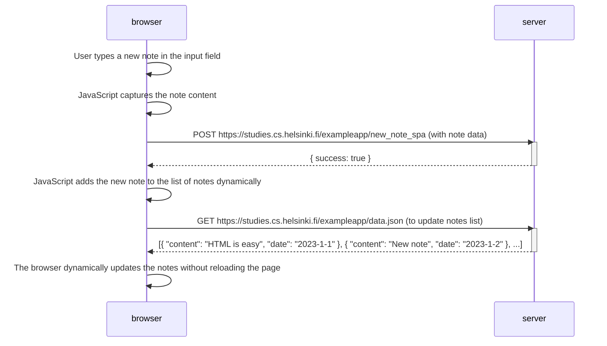

```mermaid
sequenceDiagram
    participant browser
    participant server

    browser->>browser: User types a new note in the input field

    browser->>browser: JavaScript captures the note content

    browser->>server: POST https://studies.cs.helsinki.fi/exampleapp/new_note_spa (with note data)
    activate server
    server-->>browser: { success: true }
    deactivate server

    browser->>browser: JavaScript adds the new note to the list of notes dynamically
    browser->>server: GET https://studies.cs.helsinki.fi/exampleapp/data.json (to update notes list)
    activate server
    server-->>browser: [{ "content": "HTML is easy", "date": "2023-1-1" }, { "content": "New note", "date": "2023-1-2" }, ...]
    deactivate server

    browser->>browser: The browser dynamically updates the notes without reloading the page

```
